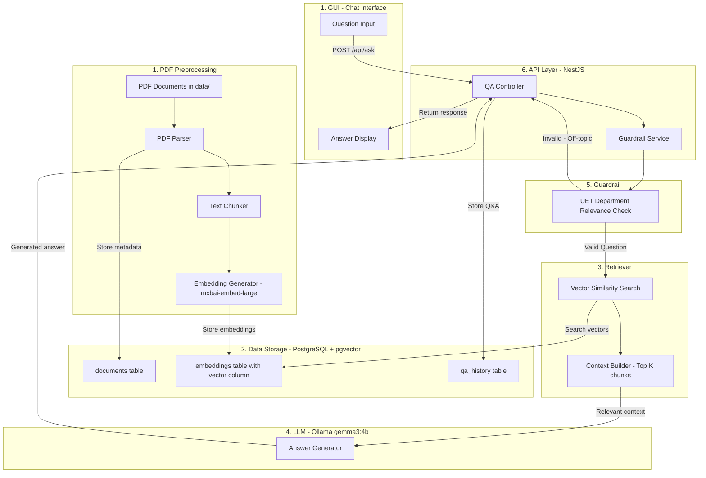
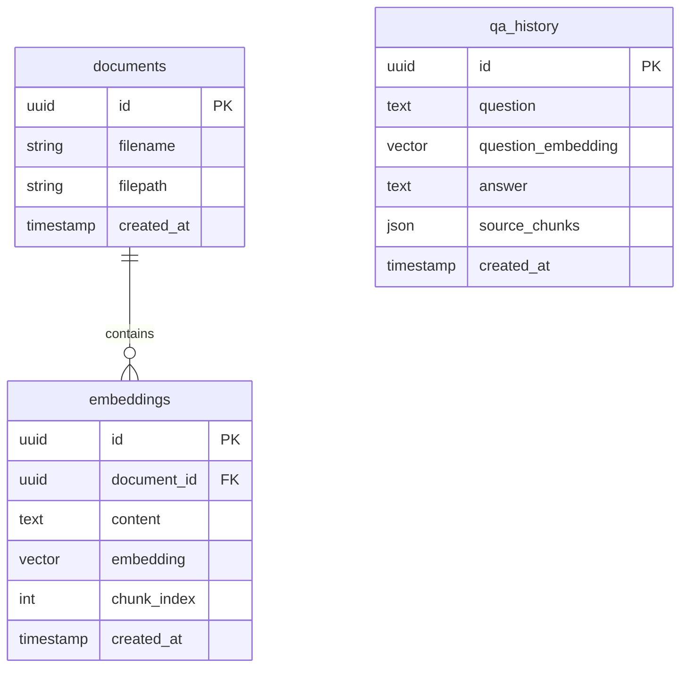
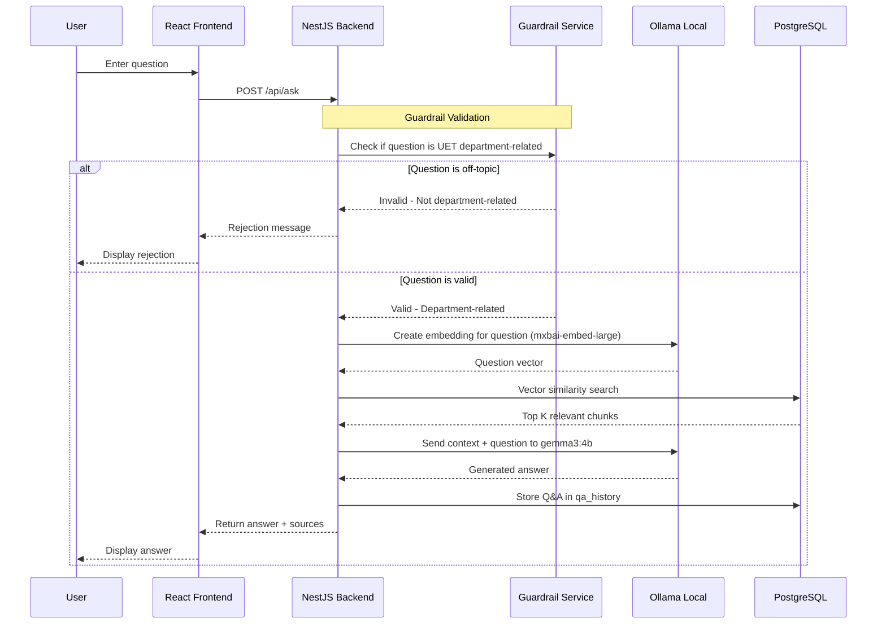

# QA System Architecture Diagram

## System Overview

A Retrieval-Augmented Generation (RAG) based question-answer system that uses PDF documents as a knowledge base, specifically designed for UET Lahore department-related queries. The system includes a Guardrail layer to ensure questions are relevant to university topics before processing.

## Architecture Diagram

This diagram shows all 7 key components of the QA system:



## Component Details

### 1. PDF Preprocessing (One-time/Batch Process)

- **PDF Parser**: Extract text from PDFs in `data/` folder
- **Text Chunker**: Split documents into smaller chunks (500-1000 tokens each)
- **Embedding Generator**: Convert chunks to vectors using Ollama `mxbai-embed-large`

### 2. Database Schema (PostgreSQL + pgvector)



### 3. Retriever (Vector Search)

- **Vector Similarity Search**: Uses pgvector's cosine similarity to find the most relevant document chunks
- **Context Builder**: Selects the top K chunks (typically 3-5) that best match the question
- **Ranking**: Chunks are ranked by similarity score to ensure the most relevant context is provided to the LLM

### 4. LLM (Large Language Model)

- **Model**: Ollama gemma3:4b running locally
- **Purpose**: Generates natural language answers based on the retrieved context
- **Input**: Question + relevant document chunks
- **Output**: Coherent answer grounded in the provided context

### 5. Guardrail (Validation Layer)

The Guardrail component ensures that questions are relevant to UET Lahore departments before processing.

**Validation Logic:**

Checks if the question relates to UET Lahore departments, academics, admissions, faculty, or campus-related topics. If the question is not related, return a polite rejection message like: "I can only answer questions about UET Lahore's departments and academic programs.

**Response Behavior:**

- **Valid questions**: Proceed to retrieval and LLM generation
- **Invalid questions**: Return a polite rejection message like:
  - "I can only answer questions about UET Lahore's departments and academic programs. Please ask a question related to the university."

### 6. API Layer (NestJS Backend)

- **Framework**: NestJS with TypeScript
- **REST API**: Exposes endpoints for question answering and history retrieval
- **Integration**: Coordinates between Guardrail, Retriever, and LLM services
- **Data Persistence**: Stores Q&A history in PostgreSQL

#### 6.1 API Layer (NestJS Backend)

- **Framework**: FastAPI with Python
- **REST API**: Exposes endpoints for question answering and history retrieval
- **Integration**: Coordinates between Guardrail, Retriever, and LLM services

### 7. GUI (Chat Interface)

- **Framework**: React with TypeScript and Vite
- **Features**:
  - Question input field
  - Real-time answer display
  - Source citation (showing which document chunks were used)
  - Question history panel
- **User Experience**: Simple, intuitive chat-like interface

### 8. Question-Answer Flow



## Project Structure

```javascript
NLP_Project/
├── data/                    # PDF documents
├── backend/                 # NestJS API
│   └── src/
│       ├── modules/
│       │   ├── embedding/   # Embedding generation & search
│       │   ├── document/    # Document ingestion
│       │   └── qa/          # Question-answer endpoint
│       └── database/        # TypeORM entities & migrations
├── frontend/                # React UI
│   └── src/
│       ├── components/      # UI components
│       └── services/        # API calls
└── scripts/                 # Data ingestion scripts
```

## Key Technologies & 7 Core Components

| Component            | Technology                       | Description                             |
| -------------------- | -------------------------------- | --------------------------------------- |
| 1. PDF Preprocessing | Node.js PDF parsers              | Extract and chunk text from PDFs        |
| 2. Data Storage      | PostgreSQL + pgvector            | Vector database for embeddings          |
| 3. Retriever         | pgvector similarity search       | Find relevant document chunks           |
| 4. LLM               | Ollama gemma3:4b (local)         | Generate natural language answers       |
| 5. Guardrail         | Custom validation service        | Filter UET department-related questions |
| 6. API Layer         | NestJS + TypeORM                 | REST API backend                        |
| 7. GUI               | React + TypeScript + Vite        | Chat interface frontend                 |
| Embeddings           | Ollama mxbai-embed-large (local) | Convert text to vectors                 |
