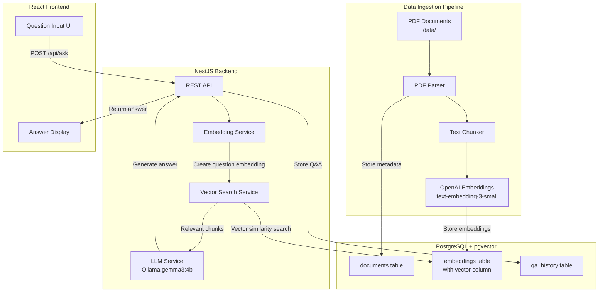
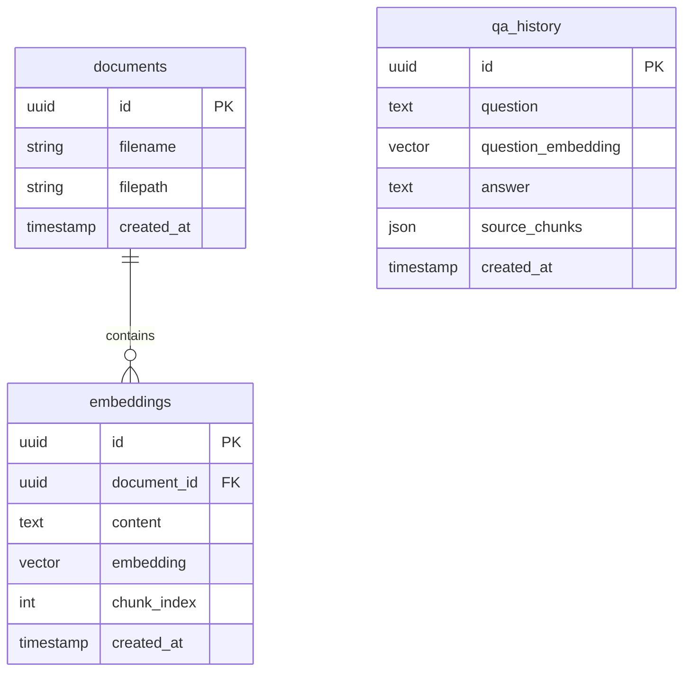
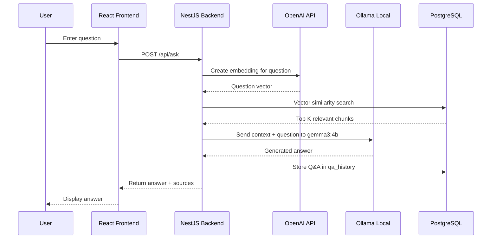

# QA System Architecture Diagram

## System Overview

A Retrieval-Augmented Generation (RAG) based question-answer system that uses your PDF documents as a knowledge base.

## Architecture Diagram



## Component Details

### 1. Data Ingestion Pipeline (One-time/Batch Process)

- **PDF Parser**: Extract text from PDFs in `data/` folder
- **Text Chunker**: Split documents into smaller chunks (500-1000 tokens each)
- **Embedding Generator**: Convert chunks to vectors using `text-embedding-3-small`

### 2. Database Schema (PostgreSQL + pgvector)



### 3. Question-Answer Flow



## Project Structure

```javascript
NLP_Project/
├── data/                    # PDF documents
├── backend/                 # NestJS API
│   └── src/
│       ├── modules/
│       │   ├── embedding/   # Embedding generation & search
│       │   ├── document/    # Document ingestion
│       │   └── qa/          # Question-answer endpoint
│       └── database/        # TypeORM entities & migrations
├── frontend/                # React UI
│   └── src/
│       ├── components/      # UI components
│       └── services/        # API calls
└── scripts/                 # Data ingestion scripts
```

## Key Technologies

| Component | Technology ||-----------|------------|| Frontend | React + TypeScript + Vite || Backend | NestJS + TypeORM || Database | PostgreSQL + pgvector || Embeddings | OpenAI text-embedding-3-small || LLM | Ollama gemma3:4b (local) |
